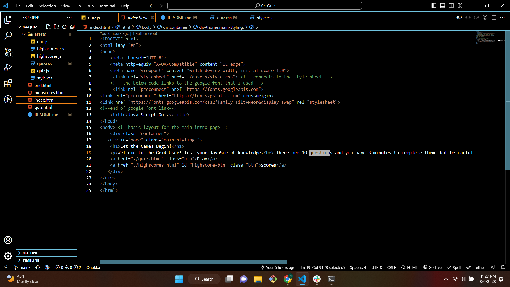
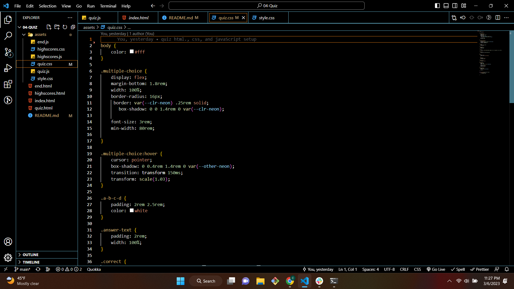
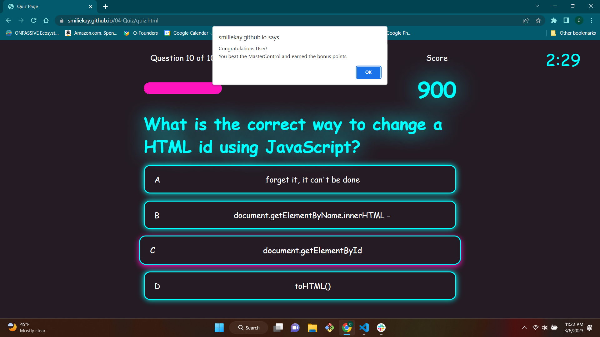
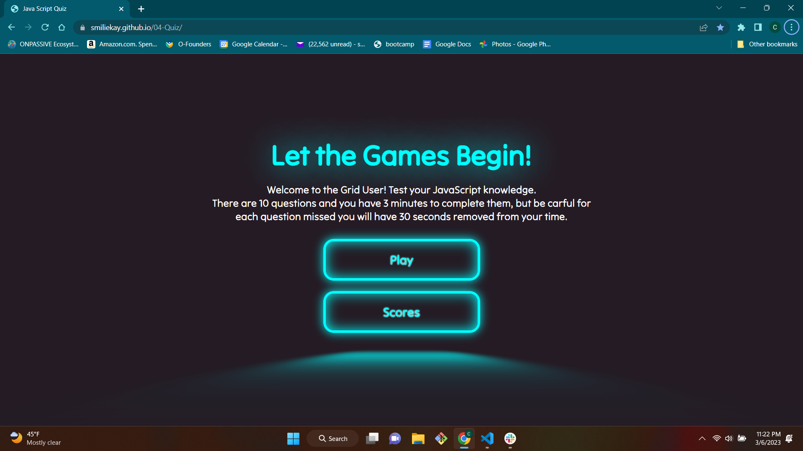
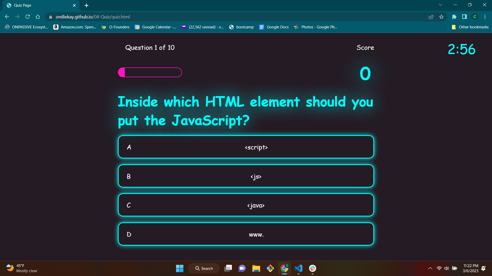
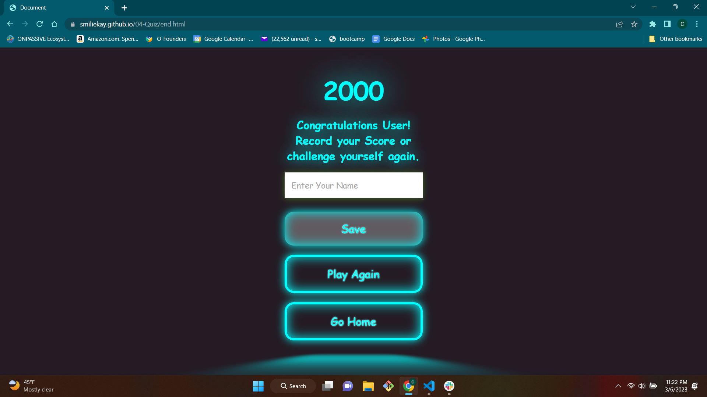
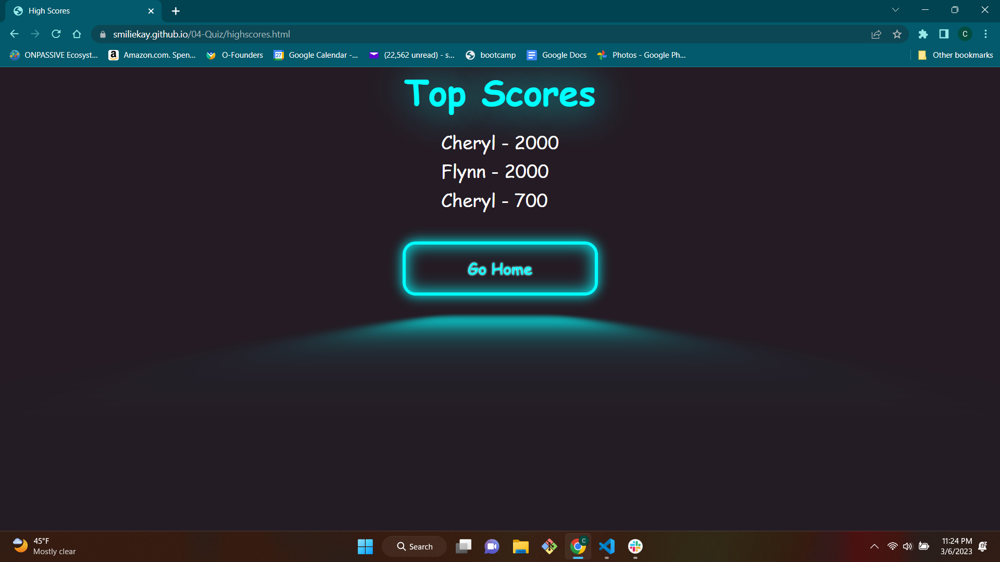

# Tron Themed JavaScript Quiz

## Main Objective 
The main objective of this project was to create a timed quiz that asked questions about JavaScript, kept score and took points away if you get a question wrong. I also wanted to make it pleasing to the eye and fun. My main focus was to have a functioning quiz page but I also wanted to have a Tron Theme to it. If you are a fan of the Tron movies you will notice the glowing effect and also many of the questions incorrect answers are Tron quotes and also on the main start page the referral to the getting into the grid and User. I also threw in a Bonus easter egg if you answer correctly in less then a minute then you get a extra 1000 points. A alert pops up telling you , you beat MasterControl. Even if you are not familiar with Tron my goal was to provide a working, enjoyable and aesthetically pleasing quiz.

## This is the link to my launched quiz site 

[ Welcome to the Grid User](https://smiliekay.github.io/Tron-Themed-JavaScript-Quiz/)

# Pictures of my work 

### Main intro code 
This is a picture of some of code for the main into page

### CSS style
This some of the CSS style code that I used 

### Easter Egg
This is the alert for the easter egg. I thought it would be more fun for people to have a little hidden surprise instead of telling them about it in the instructions, 

### Main Into
I wanted to go for a 3D kind of look with a Tron feel to it

### Game Play 
This is what the Game play looks like the timer functions and subtracts time when you get a question wrong and also turns red when you have 10 seconds or less on your time. 

### Save your score
You can save your score but you cannot save anything unless you have typed in something in the input screen. 

### The Top Scores
I have the Top Scores page set up to save the top 5 highest scores. 
